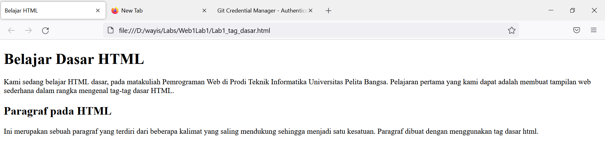

# Web1Lab1
## Belajar Tag Dasar HTML

* Membuat Paragraf
kode tag untuk paragraf adalah `
`

ini adalah tampilannya

* Menambahkan judul
kode tag untuk judul adalah `<h1>`

ini adalah tampilannya

* Memformat teks
Berikut tag yang digunakan untuk pemformatan teks
*`<b>` -bold text
*`<mark>` -Marked text
*`<ins>` -Insertedtext

ini adalah tampilannya

* Menyisipkan Gambar
kode tag untuk Gambar adalah ``

ini adalah tampilannya

* Menambahkan Hyperlink
kode tag untuk hyperlink adalah
`<nav>`
`<a href="halaman 1">Dasar HTML</a>`
`<a href="halaman 2">Halaman 2</a>`
`<a href="http://www.google.com">Halaman Web Eksternal Google</a>`
`</nav>`
`
`

ini adalah tampilannya

